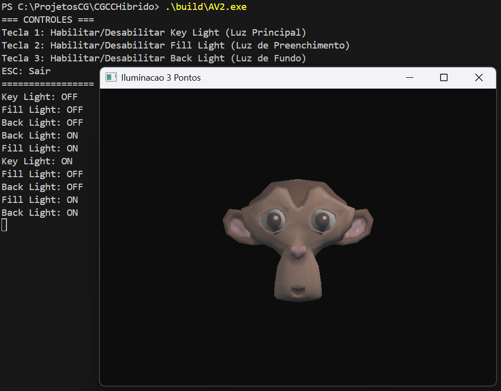

# Visualizador 3D com Técnica de Iluminação de 3 Pontos


## 📁 Estrutura Esperada de Diretórios para Compilação
```
/build
/assets/Modelos3D/
    Suzanne.obj
    Suzanne.mtl
/src/
    AV2.cpp
    ...
```

---

## 🎮 Controles de Teclado
| Tecla | Ação                                              |
| ----- | ------------------------------------------------- |
| `1`   | Liga/Desliga **Key Light** (Luz Principal)       |
| `2`   | Liga/Desliga **Fill Light** (Luz de Preenchimento) |
| `3`   | Liga/Desliga **Back Light** (Luz de Fundo)       |
| `ESC` | Sair do programa                                  |

---

## 💡 Técnica de Iluminação de 3 Pontos

### Key Light (Luz Principal)
- **Posição**: Frontal superior à direita do objeto
- **Função**: Fonte de luz mais intensa, define o tom geral da cena

### Fill Light (Luz de Preenchimento)
- **Posição**: Frontal à esquerda do objeto
- **Função**: Suaviza as sombras criadas pela luz principal

### Back Light (Luz de Fundo)
- **Posição**: Traseira superior do objeto
- **Função**: Cria separação do fundo e adiciona profundidade



---
